# 🌾 Crop Recommendation System (ML‑Powered)

    

Predict the **best crops for your field** using soil & climate signals. This project blends data preprocessing, classical ML models, and a clean Flask UI to deliver **actionable crop suggestions** for farmers and agronomists.

> 💡 **Why it matters:** Picking the right crop for local conditions improves yield, saves inputs, and boosts profitability—especially in regions with variable rainfall, soil types, and access to resources.

---

## 📌 Table of Contents

* [Overview](#-overview)
* [Key Features](#-key-features)
* [System Architecture](#-system-architecture)
* [Tech Stack](#-tech-stack)
* [Getting Started](#-getting-started)

  * [Prerequisites](#prerequisites)
  * [Installation](#installation)
  * [Run the App](#run-the-app)
  * [(Optional) Run with Docker](#optional-run-with-docker)
* [Usage](#-usage)
* [Project Structure](#-project-structure)
* [Models & Evaluation](#-models--evaluation)
* [Roadmap](#-roadmap)
* [Contributing](#-contributing)
* [Acknowledgements](#-acknowledgements)
* [Contact](#-contact)

---

## 🔭 Overview

The **Crop Recommendation System** is a machine‑learning application that recommends suitable crops for a given location/field by analyzing:

* Soil parameters (e.g., **pH**, nitrogen/phosphorus/potassium if available)
* **Temperature**, **humidity**, **rainfall**
* **Soil type** & **climatic zone**

Using historical datasets and trained ML models, the system outputs **top crop suggestions** with confidence scores so users can make informed decisions.

---

## ⭐ Key Features

* **Simple data entry**: Enter soil & weather attributes via an intuitive web form.
* **Robust preprocessing**: Missing values handling, scaling/normalization, and categorical encodings.
* **Multiple ML models**: Decision Trees, Random Forests, SVM, and Gradient Boosting.
* **Top‑N recommendations**: Get best‑fit crops ranked by predicted suitability.
* **Explainability (optional)**: View feature importances for tree‑based models.
* **Clean UI**: Flask app with responsive pages for quick interaction.

---

## 🏗️ System Architecture

```mermaid
flowchart LR
    U[User / Farmer] --> UI[Flask Web UI]
    UI --> API[(Prediction API)]
    API --> PP[Data Preprocessing]
    PP --> M[Trained ML Models]
    D[(Historical Dataset/CSV)] --> PP
    W[Real‑time Weather API] -.optional.-> PP
    M -->|Top‑N crops + scores| UI
```



---

## 🧰 Tech Stack

* **Python** for data science & backend
* **scikit‑learn** for model training & inference
* **Pandas** & **NumPy** for data wrangling
* **Flask** for the web interface & REST endpoints
* **HTML/CSS/JavaScript** for the frontend

---

## 🚀 Getting Started

### Prerequisites

* Python **3.8+**
* Git (optional but recommended)

### Installation

```bash
# 1) Clone the repo
git clone https://github.com/your-username/crop-recommendation-system.git
cd crop-recommendation-system

# 2) (Recommended) create a virtual environment
python -m venv .venv
# Windows
.venv\\Scripts\\activate
# macOS/Linux
source .venv/bin/activate

# 3) Install dependencies
pip install -r requirements.txt
```

### Run the App

```bash
# Start the Flask application
python app.py
# App will be available at
# http://localhost:5000
```

#### Environment Variables (optional)

Create a `.env` file if you plan to add API keys (e.g., weather API):

```
WEATHER_API_KEY=your_key_here
FLASK_ENV=development
PORT=5000
```

### (Optional) Run with Docker

```bash
# Build image
docker build -t crop-reco:latest .
# Run container
docker run -p 5000:5000 crop-reco:latest
```

---

## 🖱️ Usage

1. Open the app in your browser at **[http://localhost:5000](http://localhost:5000)**.
2. Enter soil & climate parameters (temperature, humidity, rainfall, pH, etc.).
3. Click **Predict** to view recommended crops with scores.
4. Explore details (and feature importances for tree‑based models, if enabled).

> ✅ Tip: Keep `node_modules/` and large datasets out of Git. Add them to `.gitignore` if you use a JS frontend.

---

## 📁 Project Structure

```
crop-recommendation-system/
├─ app.py                 # Flask entry point
├─ models/                # Trained models (.pkl) or training scripts
├─ data/                  # Sample datasets (excluded from Git if large)
├─ notebooks/             # (Optional) EDA & experiments
├─ static/                # CSS/JS assets for Flask
├─ templates/             # HTML templates (Jinja2)
├─ requirements.txt       # Python dependencies
├─ README.md              # This file
└─ .gitignore             # Ignore data dumps, env files, node_modules, etc.
```

---

## 📊 Models & Evaluation

* **Algorithms**: Decision Tree, Random Forest, SVM, Gradient Boosting.
* **Training**: Models are trained on curated historical data (soil + weather + crop yield/suitability).
* **Evaluation**: Use metrics like **accuracy**, **F1‑score**, and **Top‑K accuracy** for recommendation quality.
* **Interpretability**: For tree‑based models, inspect **feature importances** to understand drivers (e.g., pH or rainfall).

> 🔬 Consider cross‑validation and stratified splits to avoid leakage and ensure robust estimates.

**Example: Predict via Python**

```python
from joblib import load
import numpy as np

model = load("models/best_model.joblib")
X = np.array([[pH, temperature, humidity, rainfall]])
pred = model.predict(X)
```

---

## 🗺️ Roadmap

* [ ] Integrate **real‑time weather** for dynamic predictions
* [ ] Add **market price & profitability** overlays
* [ ] **Mobile app** wrapper (PWA or Flutter)
* [ ] Feedback capture loop to continually improve the model
* [ ] Model registry & experiment tracking (MLflow)

---

## 🤝 Contributing

Contributions are welcome! Please:

1. Open an issue describing the enhancement/bug.
2. Fork the repo and create a feature branch.
3. Submit a PR with a clear description and screenshots/logs where relevant.

> Please follow conventional commit messages and run lint/tests before opening PRs.

---

## 🙏 Acknowledgements

Thanks to the **agricultural research community**, **farmers**, and supporting **organizations** for data, domain knowledge, and insights that made this project possible.

---

## 📬 Contact

Have questions or ideas?

* **Email:** [611noorsaeed@gmail.com](mailto:611noorsaeed@gmail.com)
* **Issues/Requests:** Open an issue on the GitHub repository

---

### 📝 Notes

* Replace `your-username` with your actual GitHub handle in the clone URL.
* Add screenshots to `docs/` and reference them in this README for a more visual experience.
* If you add licensing, include a `LICENSE` file (MIT/Apache‑2.0 are popular choices).
